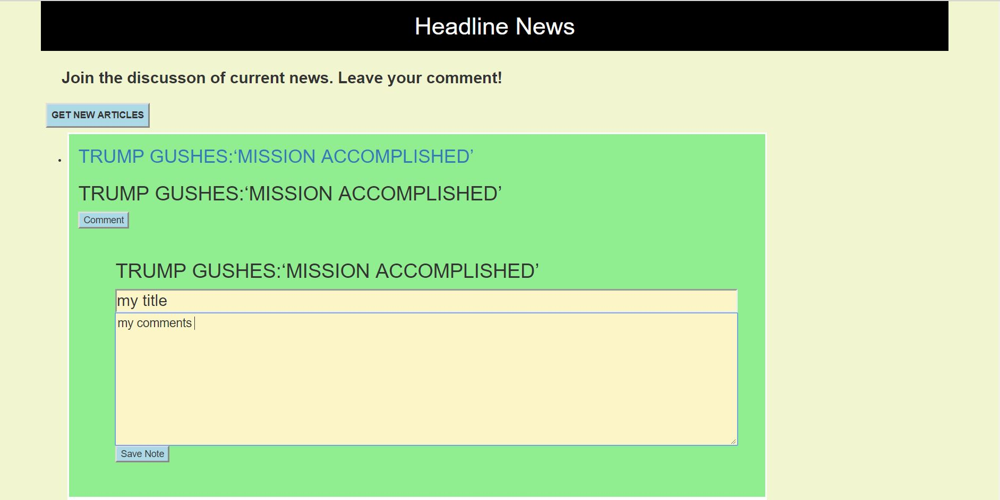

# NewsScraper

## Full Stack web app that lets users view and leave comments on the ## latest news using node, handlebars, express, Mongoose and Cheerios.

# Whenever a user selects the “GET NEW ARTICLES” button, 
* NewsScraper retrieves stories from Huffington Post and displays the  title and link. 
* Each scraped article is saved to your application database. 

# NewsScraper displays the following information for each article:

     * Headline - the title of the article

     * URL - the url to the original article

# The user can select he “Comment” button to insert their thoughts about the article.

##### Below shows the main screen

##### Below shows the comment section of the screen

